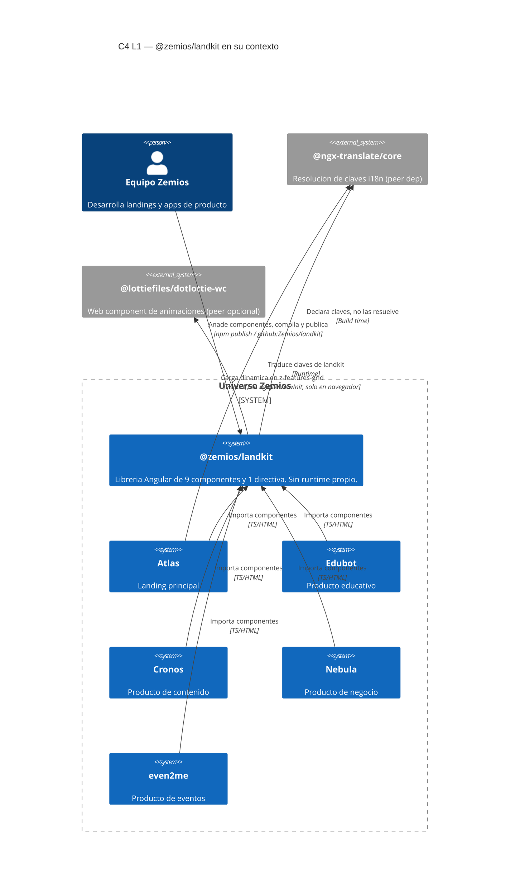
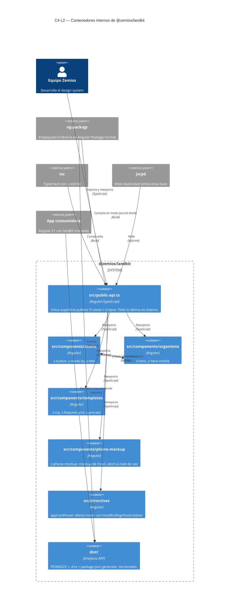

# Contexto del sistema

Diagramas C4 de `@zemios/landkit` **en su estado actual**. Renderizan en GitHub sin
tooling: son codigo Mermaid, no imagenes. L1 y L2 son suficientes aqui; L3 solo se dibuja
cuando un contenedor es complejo, y este repo tiene un unico contenedor.

> **Nota sobre el renderizado.** Mermaid marca sus diagramas C4 como **experimentales**
> (los marca con un aviso en su propia documentacion), asi que un renderizador con la
> funcionalidad desactivada mostrara el codigo fuente en lugar del dibujo. Por eso cada
> diagrama va acompanado de su lista de nodos y relaciones en prosa: **la informacion no
> depende de que el diagrama se pinte.** Si algun dia hace falta garantizar renderizado
> incondicional, la conversion a `flowchart` con etiquetas al estilo C4 es el plan B.

---

## C4 L1 — Contexto de sistema

Que es landkit y quien lo usa, visto desde fuera.

**Lo que este diagrama dice y no es obvio**: landkit no tiene entradas de usuario, ni
salidas, ni estado. Su unica "interaccion" es ser importado. Todo lo que ocurre en
tiempo de ejecucion ocurre dentro de la app consumidora.

---

## C4 L2 — Contenedores

El repo entero es un contenedor. Se descomponen sus piezas internas.

---

## Leyenda y limites de estos diagramas

- **L4 (codigo) no se dibuja**: `z-button.ts` no es un nodo. Si lo fuera, el diagrama
  seria el propio repositorio.
- El contenedor `dist/` aparece porque es la frontera real entre este repo y los
  consumidores: es lo unico que se importa desde fuera. `src/` es interno.
- `tsc`, `ng-packagr` y `jscpd` estan fuera del limite del sistema porque son
  herramientas de build, no parte del producto.
- Las flechas entre capas de componentes describen composicion en plantillas, no llamadas
  en runtime: Angular compone el arbol, no hay imports de componente a componente.

## Donde seguir

- Composicion interna de cada componente: `src/public-api.ts` y el codigo.
- Por que `dist/` esta versionado: [ADR-0002](../adr/0002-versionar-dist-para-consumo-por-git.md).
- Decisiones con su historia: [docs/adr/](../adr/).
